# ChargeHub — Technical Design Document (TDD)

**Version:** 5.0
**Status:** Draft — V5 (Order terminology, no SessionService, refund flow)
**Owner:** Ashish
**Related PRD:**
[ChargeFinder_PRD_V3](./ChargeFinder_PRD_V3.md) _(product was renamed ChargeFinder → ChargeHub; PRD filenames/content are unchanged — treat "Chargefinder" references inside them as ChargeHub)_
**DOC**: https://docs.google.com/document/d/1fVdLcuFMi2X1SHzRa_Z4A2ba-yWB0FKWc8RWbfKGwv4/edit?tab=t.0
**UX**: https://stitch.withgoogle.com/projects/3324515615018009860

---

## 1. Related Documents

| Document         | Location                                                                      | Notes                                                                                                                          |
| ---------------- | ----------------------------------------------------------------------------- | ------------------------------------------------------------------------------------------------------------------------------ |
| PRD (current)    | [ChargeFinder_PRD_V3](./ChargeFinder_PRD_V3.md)                               | Source of truth for scope, flows, must-haves — booking + payment + CPO accountability model                                    |
| PRD (superseded) | [ChargeFinder_PRD_V2](./ChargeFinder_PRD_V2.md)                               | Earlier discovery-only scope; kept for history, no longer authoritative                                                        |
| UX / Wireframes  | [UX](https://claude.ai/public/artifacts/feb2801e-977c-44d6-a330-7261a3a80467) | Reflects an earlier web-based, discovery-only flow — needs a full pass now that both apps are mobile and the flow is pay-first |

**Assumptions carried from PRD V3:**

- single launch city, 3–5 pilot CPOs, 10–20 stations at launch,
- 8-week MVP delivery window (per PRD §21),
- CPO Portal is the **only** operator management model in MVP,
- **payment happens upfront, before the charging service is rendered** — the driver books and pays first to unlock the session; there's no separate post-charge settlement step.

---

## 2. Overview

ChargeHub MVP is a **pay-first booking app**, delivered as two native mobile apps plus one internal surface:

1. **Driver App** (Expo/React Native) — vehicle setup, map discovery, charger detail, order + payment, charging status, favoriting, fault reporting, reviews & ratings, refunds.
2. **CPO Portal** (Expo/React Native) — station/connector setup, pricing, maintenance mode, order calendar, daily status acknowledgement, settlement summary.
3. **Admin/Internal tools** — pilot monitoring, discrepancy/accountability oversight, refund oversight.

**Terminology change in this revision:** what was previously called a "Booking" is now an **Order** — `BookingService` → `OrderService`, `BookingRepository` → `OrderRepository`, `bookings` collection → `orders` collection, `/bookings` → `/orders`.

**Structural change in this revision:** there is **no separate `SessionService`**. The flow is pay-first: the driver books and pays online to unlock the charging service; the order itself carries the full lifecycle (placed → paid → charging → completed), so a distinct "session" concept doesn't add anything an order status transition doesn't already cover. Charging start/stop are just order status transitions, owned by `OrderService`.

**Design goals for this revision:**

- Order-first, pay-first: a driver cannot start charging without a `CONFIRMED` (paid) order.
- Refunds are a first-class flow, not an afterthought — covering both driver-initiated cancellation and system/CPO-triggered refunds (e.g. a station getting delisted mid-order).
- Keep payment handling thin: `PaymentService` orchestrates the gateway, it doesn't hold funds.
- Services are named for what they do; composition over inheritance throughout.

**Scope notes carried over:**

- CPO Portal is core MVP. External CPO API sync is out of MVP (§14 Future Scope).
- Cost/time estimation is folded into `OrderService`.
- Both client apps are mobile (Expo + React Native).
- `ReviewsAndRatingService` remains: a driver rates/reviews after a completed order.

---

## 3. Architecture

### 3.1 High-level component diagram

For better open this link: https://drive.google.com/file/d/1rwl_tTzs5ImbToktSO5W2ww4pXulg4az/view?usp=sharing

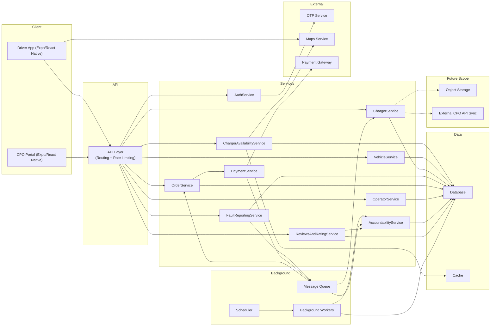

### 3.1.1 Flow Steps & Explanation

### 1. Client entry — Driver App and CPO Portal

- Both the **Driver App** and **CPO Portal** (Expo/React Native mobile apps) route all requests through the **API Layer (Gateway)** — they never call a service directly.
- The Gateway handles both **routing and rate limiting**, so no single client/IP can overload the backend.
- The Driver App also calls **Maps Service** directly (client-side rendering, location picking, navigation) — this is the one exception where the gateway is bypassed, since it's purely a UI-side, non-sensitive map interaction.

### 2. Authentication flow

- A login/signup request goes from the Gateway to **AuthService**.
- AuthService calls the external **OTP Service** for mobile number verification — both OTP generation and validation go through this external dependency.
- After successful authentication, a session/token is returned to the client for use in subsequent requests.

### 3. Charger discovery flow (Availability)

- When a driver searches for nearby chargers, the request goes to **ChargerAvailabilityService**.
- This service combines data from three sources:
  - **Maps Service** for geolocation/distance calculation
  - **Database** (MongoDB with geospatial indexing) for actual charger records
  - **Cache** (Redis) for frequently-accessed availability data — avoiding repeated DB hits and keeping responses fast.

### 4. Vehicle & Charger management flow

- **VehicleService**: handles a driver adding/editing their vehicle — persists directly to the Database.
- **ChargerService**: manages core charger data (details, status, pricing), reading/writing to the Database.
- ChargerService has a dotted connection to — **External CPO API Sync** and **Object Storage**(Future Scope) — not part of MVP yet, but planned for automated CPO data sync and storing charger images/documents.

### 5. Order placement flow

- When a driver books a charging slot, the request goes to **OrderService**, which creates an order in the Database (status: `placed`).
- OrderService directly triggers **PaymentService** — this is a pay-first model, meaning the charging session only starts after payment (there's no separate SessionService; order status itself tracks the lifecycle: placed → paid → charging → completed).
- PaymentService processes the actual transaction via the external **Payment Gateway**.
- Once payment completes, PaymentService pushes an event onto the **Message Queue**.

### 6. Async/Queue-driven flow (for decoupling)

- The **Message Queue** is the backend's central async communication hub:
  - **FaultReportingService** pushes fault reports onto the queue
    **Consumer**
    Consumers pick these events up and propagate them further: - To **ChargerService** — to update charger status based on a fault report (e.g., marking it out-of-service) - To **AccountabilityService** — for CPO penalty/tracking (e.g., a missed daily status acknowledgement)
  - **PaymentService** pushes payment-related events (success/failure/refund) onto the queue
    **Consumer**
    Consumers pick these events up and propagate them further: - To **OrderService** — to sync/update order status after payment confirms or fails
- This decoupled design means services don't call each other directly — they communicate asynchronously via the queue, keeping the system resilient and scalable.

### 7. Background jobs — Scheduler + Workers

- **Scheduler** fires periodic triggers (e.g., daily CPO status check).
- **Worker** picks up the trigger and calls **AccountabilityService**, which evaluates the CPO's daily acknowledgement/penalty logic, with the result persisted to the **Database**.
- This entire flow runs independent of client requests — it's purely time-based automation.

### 8. Reviews & Accountability

- After an order completes, the driver can leave a review → this goes to **ReviewsAndRatingService**, which stores it in the Database.
- ReviewsAndRatingService also signals **AccountabilityService**, so poor ratings feed into the CPO's accountability score.

### 9. CPO Portal specific flow

- Requests from the CPO Portal go to **OperatorService** — where the CPO manages their profile, chargers, and daily acknowledgements.
- OperatorService interacts directly with the Database.

### 10. Future Scope (dotted lines)

- **External CPO API Sync**: automated integration with larger CPOs — syncing real-time charger data via their API instead of manual backfill.
- **Object Storage**: for storing charger images, documents, or fault-proof photos — not in scope yet, planned for later.

### 3.2 Component responsibilities

- **`AuthService`** — Phone OTP issuance/verification, session tokens (drivers); separate credential flow for CPO Portal (see §8).
- **`VehicleService`** — CRUD for "My Vehicles," vehicle-type → connector/compatibility mapping (PRD §6).
- **`ChargerAvailabilityService`** — geospatial nearby-charger queries, 2W/4W filter, compatibility filter, cached responses; ranking factors in the trust score from `AccountabilityService`.
- **`ChargerService`** — source of truth for static + dynamic charger data; owns the freshness label logic and favorited-chargers list.
- **`OrderService`** — owns the full order lifecycle: slot selection, estimate, order creation, payment coordination, charging start/complete, cancellation, and refund initiation. Composes an `IChargerAllocationStrategy` and an `IPricingStrategy` (§5.2).
- **`PaymentService`** — thin orchestration over the external Payment Gateway: creates a payment intent, confirms payment, generates invoice/receipt, **initiates and tracks refunds**. Does not hold funds. Webhook events (payment and refund) are processed asynchronously via the Message Queue.
- **`FaultReportingService`** — accepts timestamped reports, triggers "confirm if you're there" flow, feeds `AccountabilityService`.
- **`ReviewsAndRatingService`** — accepts a rating/review after a completed order, exposes a charger's reviews, feeds `AccountabilityService`'s trust score.
- **`OperatorService`** — CPO Portal backend: station/connector CRUD, pricing, maintenance mode, out-of-service reason, order calendar (operator side), settlement summary. Can trigger a system-initiated refund (e.g. delisting a station mid-order) via `PaymentService`.
- **`AccountabilityService`** — daily acknowledgement tracking, discrepancy history, trust score, visibility/delisting decisions (PRD §12).
- **Scheduler + Background Workers** — freshness decay, fault-report decay, daily acknowledgement check.
- **Message Queue** — decouples fault-report, review, and payment/refund webhook processing from the request path.

All services that talk to the database do so exclusively through a **Repository** layer (see §5.5).

### 3.3 Why this shape

- **Order absorbs what Session used to do**: because the app is pay-first, "book," "pay," and "charge" are all states of one lifecycle, not separate concerns needing separate services. Splitting them added a service boundary (and a network hop) without an independent consistency need — Session's only real job was status tracking, which `OrderService` already needs to do for its own status field.
- **Refund lives in `PaymentService`, triggered by `OrderService` or `OperatorService`**: refunds are a payment-domain operation (talking to the gateway, tracking refund status) but can be triggered by different callers — a driver cancelling their own order, or the system/a CPO cancelling on their behalf. Keeping the trigger flexible but the execution centralized avoids duplicating gateway-refund logic in two places.
- **Composition over inheritance, unchanged**: `OrderService` _has a_ `IChargerAllocationStrategy`, _has a_ `IPricingStrategy`, _has a_ `OrderRepository` — no shared base class.
- **CPO Portal as the only operator surface, payment kept thin, both clients on one native stack** — unchanged from the prior revision, see §4.

---

## 4. Tech Stack / Dependencies

### 4.1 Frontend (Driver App + CPO Portal — both mobile)

| Concern           | Choice                                 | Notes                                                                   |
| ----------------- | -------------------------------------- | ----------------------------------------------------------------------- |
| Core stack        | Expo + React Native + TypeScript       | Single codebase pattern for both apps                                   |
| Navigation        | React Navigation                       | Native Stack for app flow, Bottom Tabs for top-level sections           |
| State management  | Zustand                                | Shared app state only                                                   |
| Design system     | React Native Reusables                 | Small custom UI kit: button, input, card, screen wrapper, modal, loader |
| Forms             | React Hook Form + Zod                  |                                                                         |
| Local storage     | AsyncStorage                           | Non-sensitive data only; tokens go in `expo-secure-store`               |
| Maps              | Google Maps SDK (React Native)         |                                                                         |
| Live data         | Long polling                           | Order/charging status                                                   |
| Error handling    | Error boundaries per screen/section    |                                                                         |
| Business logic    | API hooks                              |                                                                         |
| Static analysis   | ESLint + SonarQube                     |                                                                         |
| Unit testing      | React Native Testing Library           |                                                                         |
| Observability     | Sentry (`sentry-expo`)                 |                                                                         |
| Product analytics | Microsoft Clarity + Google Analytics 4 | Mobile SDKs                                                             |
| Build/release     | EAS Build + EAS Update                 | Preview/production builds, OTA JS patches                               |

### 4.2 Backend

| Concern                   | Choice                                                                    | Notes                                                                                        |
| ------------------------- | ------------------------------------------------------------------------- | -------------------------------------------------------------------------------------------- |
| Runtime/framework         | Node.js + Express                                                         |                                                                                              |
| Compute                   | EC2 (Auto Scaling Group, multiple instances)                              |                                                                                              |
| Database access           | Repository classes implementing `IRepository<T>` (e.g. `OrderRepository`) |                                                                                              |
| Database                  | MongoDB Atlas (managed)                                                   | `2dsphere` geo index; TTL for stale fault reports; unique compound index for order slots     |
| Cache                     | Redis (ElastiCache)                                                       | Nearby-search cache, distributed locks for order concurrency                                 |
| Background/scheduled work | Scheduler + Background Workers                                            | Freshness decay, fault decay, daily acknowledgement check, payment/refund webhook processing |
| Queue                     | SQS                                                                       |                                                                                              |
| API layer                 | API Gateway                                                               | Routing + rate limiting                                                                      |
| Auth                      | Custom OTP service + JWT (driver); separate credentials (CPO Portal)      |                                                                                              |
| Maps                      | Google Maps Platform                                                      |                                                                                              |
| Payments                  | External payment gateway (Razorpay/Stripe-style)                          | Supports both charge and refund APIs — vendor choice open, see §14                           |
| Infra as code             | Terraform                                                                 |                                                                                              |

### 4.3 CI/CD

| App                    | Pipeline                      | Target                                      |
| ---------------------- | ----------------------------- | ------------------------------------------- |
| Driver App, CPO Portal | EAS Build / EAS Update        | Preview + production builds; OTA JS patches |
| Express backend        | GitHub Actions (`deploy.yml`) | Deploys to EC2                              |

### 4.4 Observability & Analytics

| Concern                                                  | Tool                                  | Notes               |
| -------------------------------------------------------- | ------------------------------------- | ------------------- |
| Logging, tracing, performance, error tracking, telemetry | Sentry                                | Both apps + backend |
| Product/behavioral analytics                             | Microsoft Clarity, Google Analytics 4 |                     |

---

## 5. Low-Level Design (LLD)

### 5.1 Entity Relationship Diagram

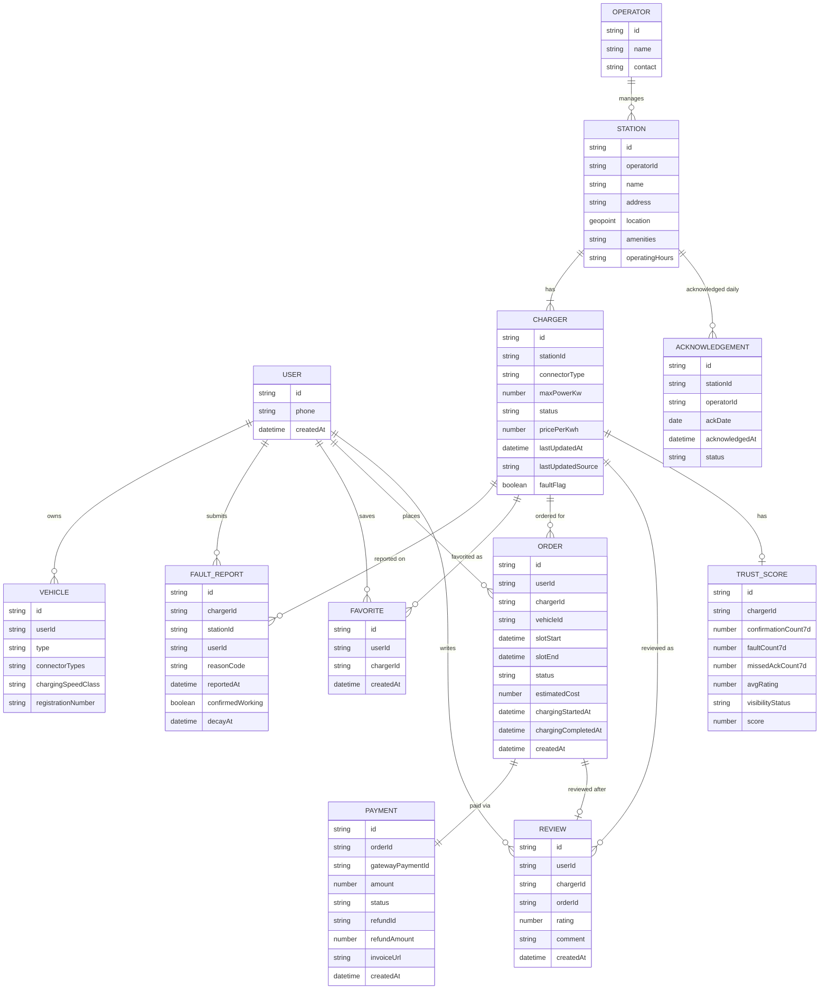

Note: `SESSION` is removed. Charging start/complete timestamps now live directly on `ORDER` (`chargingStartedAt`, `chargingCompletedAt`).

### 5.2 Class & Interface diagram

```mermaid
classDiagram
    class IPricingStrategy {
        <<interface>>
        +calculatePrice(basePrice: number) number
    }
    class MarkupPricingStrategy {
        -markupPercent: number
        +calculatePrice(basePrice: number) number
    }
    IPricingStrategy <|.. MarkupPricingStrategy

    class IChargerAllocationStrategy {
        <<interface>>
        +selectCharger(candidates: Charger[]) Charger
    }
    class FirstAvailableStrategy {
        +selectCharger(candidates: Charger[]) Charger
    }
    class NearestAvailableStrategy {
        +selectCharger(candidates: Charger[], location: GeoPoint) Charger
    }
    IChargerAllocationStrategy <|.. FirstAvailableStrategy
    IChargerAllocationStrategy <|.. NearestAvailableStrategy

    class IRepository~T~ {
        <<interface>>
        +findById(id: string) T
        +create(data: object) T
        +update(id: string, data: object) T
    }
    class OrderRepository {
        +findById(id: string) Order
        +create(data: object) Order
        +tryReserveSlot(chargerId: string, slotStart: Date, slotEnd: Date) Order
        +transitionStatus(orderId: string, fromStatus: string, toStatus: string) Order
    }
    class PaymentRepository {
        +findById(id: string) Payment
        +transitionStatus(paymentId: string, fromStatus: string, toStatus: string) Payment
        +recordRefund(paymentId: string, refundId: string, amount: number) Payment
    }
    class ChargerRepository {
        +findNearby(query: object) Charger[]
        +updateStatus(chargerId: string, status: string) Charger
    }
    class ReviewRepository {
        +create(data: object) Review
        +findByCharger(chargerId: string) Review[]
    }
    IRepository <|.. OrderRepository
    IRepository <|.. PaymentRepository
    IRepository <|.. ChargerRepository
    IRepository <|.. ReviewRepository

    class OrderService {
        -allocationStrategy: IChargerAllocationStrategy
        -pricingStrategy: IPricingStrategy
        -orderRepository: OrderRepository
        +createOrder(request: OrderRequest) Order
        +startCharging(orderId: string) Order
        +completeCharging(orderId: string) Order
        +cancelOrder(orderId: string) Order
    }
    OrderService o-- IChargerAllocationStrategy
    OrderService o-- IPricingStrategy
    OrderService o-- OrderRepository

    class PaymentService {
        -paymentRepository: PaymentRepository
        -gatewayClient: PaymentGatewayClient
        +createIntent(order: Order) PaymentIntent
        +handlePaymentWebhook(event: WebhookEvent) void
        +initiateRefund(orderId: string, reason: string) Refund
        +handleRefundWebhook(event: WebhookEvent) void
    }
    PaymentService o-- PaymentRepository

    class ChargerAvailabilityService {
        -chargerRepository: ChargerRepository
        +findNearby(query: object) Charger[]
    }
    ChargerAvailabilityService o-- ChargerRepository

    class ReviewsAndRatingService {
        -reviewRepository: ReviewRepository
        +submitReview(orderId: string, rating: number, comment: string) Review
        +getChargerReviews(chargerId: string) Review[]
    }
    ReviewsAndRatingService o-- ReviewRepository
```

### 5.3 State diagrams

**Order** (absorbs what "Booking" + "Session" used to model separately)

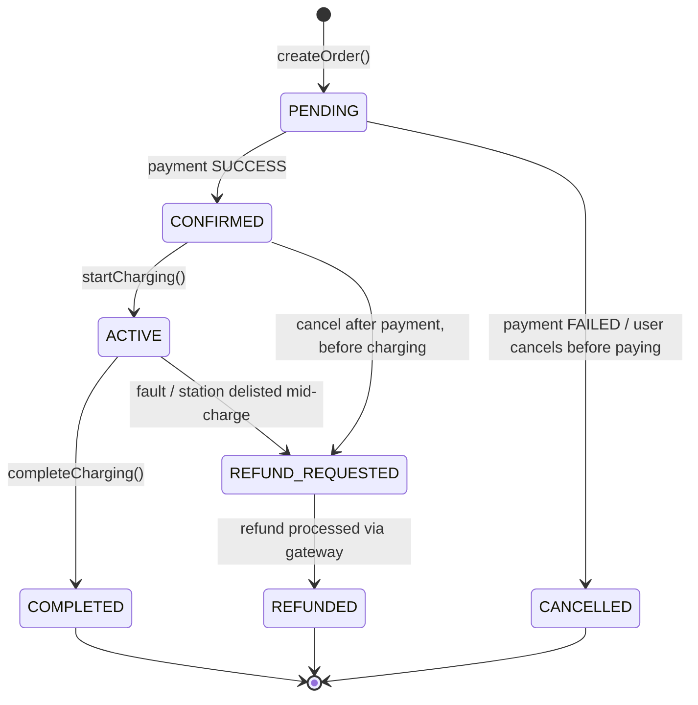

**Payment** (with refund sub-flow)

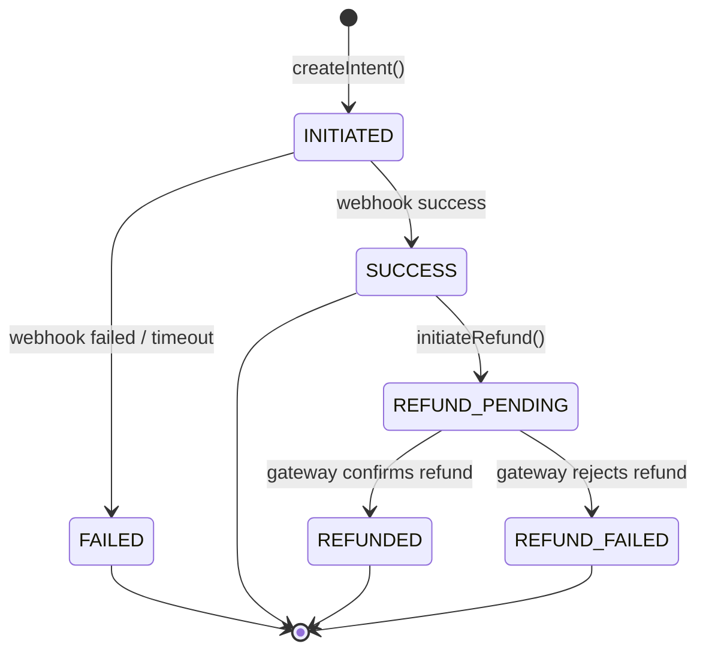

**Charger status** (unchanged)

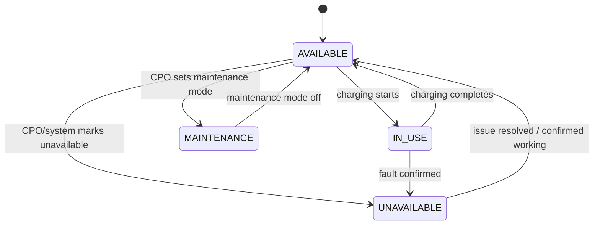

### 5.4 Concurrency Handling

| Race condition                    | Mechanism                                                                                                                                                                                  |
| --------------------------------- | ------------------------------------------------------------------------------------------------------------------------------------------------------------------------------------------ |
| Double-booking a slot             | Redis lock (`SET lock:charger:{id}:{slotStart} NX PX 5000`) for fast-fail UX, **plus** a MongoDB unique compound index on `(chargerId, slotStart, slotEnd)` scoped to non-cancelled orders |
| Payment webhook replay            | Conditional atomic update: `findOneAndUpdate({ paymentId, status: "INITIATED" }, { $set: { status: "SUCCESS" } })`                                                                         |
| Refund webhook replay             | Same pattern: `findOneAndUpdate({ paymentId, status: "REFUND_PENDING" }, { $set: { status: "REFUNDED" } })` — a replayed refund webhook is a safe no-op                                    |
| Duplicate charging start/complete | `findOneAndUpdate({ orderId, status: "CONFIRMED" }, { $set: { status: "ACTIVE", chargingStartedAt: now } })` and the equivalent for `ACTIVE → COMPLETED`                                   |
| Charger status write conflicts    | Atomic field-level operators (`$set`/`$inc`) instead of fetch-modify-save                                                                                                                  |

**Order race — sequence diagram:**

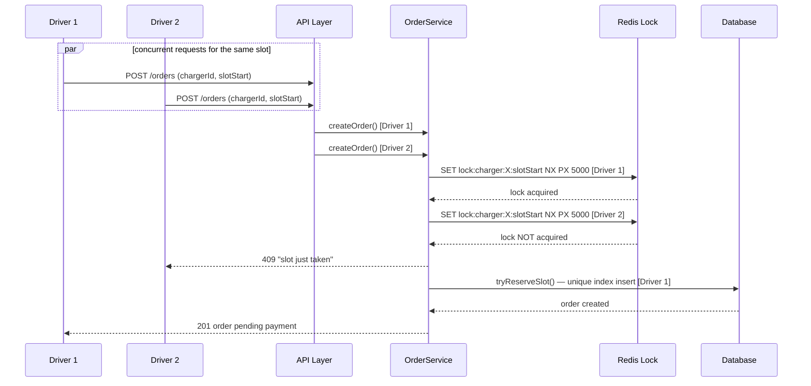

### 5.5 Repository layer

```javascript
const vehicle = await VehicleRepository.findById(vehicleId);
const nearby = await ChargerRepository.findNearby({
  lat,
  lng,
  radiusKm,
  vehicleType,
});
const order = await OrderRepository.tryReserveSlot(
  chargerId,
  slotStart,
  slotEnd,
);
const payment = await PaymentRepository.transitionStatus(
  paymentId,
  "INITIATED",
  "SUCCESS",
);
await OrderRepository.transitionStatus(orderId, "CONFIRMED", "ACTIVE");
await OrderRepository.transitionStatus(orderId, "ACTIVE", "COMPLETED");
await PaymentRepository.recordRefund(paymentId, refundId, amount);
await AcknowledgementRepository.record(stationId, operatorId, ackDate);
await FavoriteRepository.add(userId, chargerId);
await ReviewRepository.create({ userId, chargerId, orderId, rating, comment });
```

Repositories to define at minimum: `UserRepository`, `VehicleRepository`, `StationRepository`, `ChargerRepository`, `FaultReportRepository`, `FavoriteRepository`, `OrderRepository`, `PaymentRepository`, `AcknowledgementRepository`, `TrustScoreRepository`, `ReviewRepository`. _(`SessionRepository` removed — no longer applicable.)_

### 5.6 Core data model (MongoDB, shape reference)

```javascript
// orders  (formerly "bookings")
{
  _id, userId, chargerId, vehicleId,
  slotStart, slotEnd,
  status: "PENDING" | "CONFIRMED" | "ACTIVE" | "COMPLETED" | "CANCELLED" | "REFUND_REQUESTED" | "REFUNDED",
  estimatedCost,
  chargingStartedAt, chargingCompletedAt,
  createdAt
}
// unique index: { chargerId: 1, slotStart: 1, slotEnd: 1 } (partial: status not in ["CANCELLED", "REFUNDED"])

// payments
{
  _id, orderId, gatewayPaymentId,
  amount, status: "INITIATED" | "SUCCESS" | "FAILED" | "REFUND_PENDING" | "REFUNDED" | "REFUND_FAILED",
  refundId, refundAmount,
  invoiceUrl, createdAt
}

// reviews
{
  _id, userId, chargerId, orderId,
  rating, comment, createdAt
}

// acknowledgements
{
  _id, stationId, operatorId, ackDate,
  acknowledgedAt, status: "ACKNOWLEDGED" | "MISSED"
}

// trust_scores
{
  _id, chargerId,
  confirmationCount7d, faultCount7d, missedAckCount7d, avgRating,
  visibilityStatus: "NORMAL" | "REDUCED" | "DELISTED",
  score
}
```

### 5.7 Key API contracts (representative, not exhaustive)

```
POST /auth/otp/request        { phone }
POST /auth/otp/verify         { phone, otp } -> { accessToken, refreshToken }

POST /vehicles                { type, connectorTypes, registrationNumber? }
GET  /vehicles                -> [Vehicle]

GET  /chargers/nearby?lat&lng&radiusKm&vehicleId&type=2W|4W
     -> [{ stationId, chargerId, distance, status, price, powerKw, freshness }]

GET  /chargers/:chargerId              -> full detail
GET  /chargers/:chargerId/estimate?vehicleId  -> { travelTimeMin, waitTimeMin, chargeTimeMin, estimatedCost }
GET  /chargers/:chargerId/reviews      -> [Review]

POST /orders                  { chargerId, vehicleId, slotStart, slotEnd } -> { orderId, status, estimatedCost }
GET  /orders/:id              -> order detail
POST /orders/:id/cancel

POST /payments                { orderId } -> { paymentIntentId, gatewayClientSecret }
POST /payments/:id/confirm    -> { status }
POST /payments/webhook        (gateway -> ChargeHub, signature-verified)

POST /orders/:id/start-charging     -> order status ACTIVE
POST /orders/:id/complete-charging  -> order status COMPLETED, triggers invoice

POST /orders/:id/refund       { reason }  -> initiates refund via PaymentService
POST /payments/refund-webhook (gateway -> ChargeHub, signature-verified)

POST /reviews                 { orderId, rating, comment }

POST   /chargers/:chargerId/favorite
DELETE /chargers/:chargerId/favorite
GET    /favorites              -> [Charger]

POST /reports                 { chargerId, reasonCode, note }
POST /reports/:id/confirm     { confirmedWorking: boolean }

# CPO Portal
POST  /operator/stations
PATCH /operator/chargers/:id/status
PATCH /operator/chargers/:id/pricing
PATCH /operator/chargers/:id/maintenance-mode
POST  /operator/stations/:id/acknowledge   { ackDate }
GET   /operator/stations/:id/settlement-summary
POST  /operator/orders/:id/force-refund    { reason }   // e.g. delisting mid-order
```

### 5.8 Screen structure (Expo/React Native)

**Driver App**

```
RootNavigator (Native Stack)
 ├─ AuthFlow (OtpRequest, OtpVerify)
 ├─ MainTabs (Bottom Tabs)
 │   ├─ MapTab (MapView, FilterBar, ChargerMarkerLayer, NearbyListSheet)
 │   ├─ OrdersTab (OrderHistory, InvoiceList)
 │   ├─ FavoritesTab
 │   └─ ProfileTab (VehicleSetup)
 ├─ ChargerDetail (stack screen: StatusBadge, EstimateBlock, FavoriteToggle,
 │   SlotPicker, ReviewsList, ReportIssueModal, OnSiteConfirmPrompt)
 ├─ OrderFlow (stack: OrderSummary, PaymentStep, OrderConfirmation)
 └─ OrderTracker (stack: live charging status, StartChargingAction,
     CompleteChargingAction, CancelOrRefundAction, ReviewPrompt)
```

**CPO Portal** — unchanged from prior revision (StationsTab, BookingCalendarTab → **OrdersCalendarTab**, AcknowledgementTab, SettlementTab).

Each tab/section wrapped in its own error boundary. Business logic lives in API hooks (`useNearbyChargers()`, `useCreateOrder()`, `useOrderStatus()`, `useRequestRefund()`).

### 5.9 Freshness & fault-decay logic

Unchanged from the prior revision — see §5.4 for the write-conflict handling that makes this safe under concurrent writers.

---

## 6. Flow / Sequence Diagrams

### 6.1 Flow 1 — Place and pay for an order

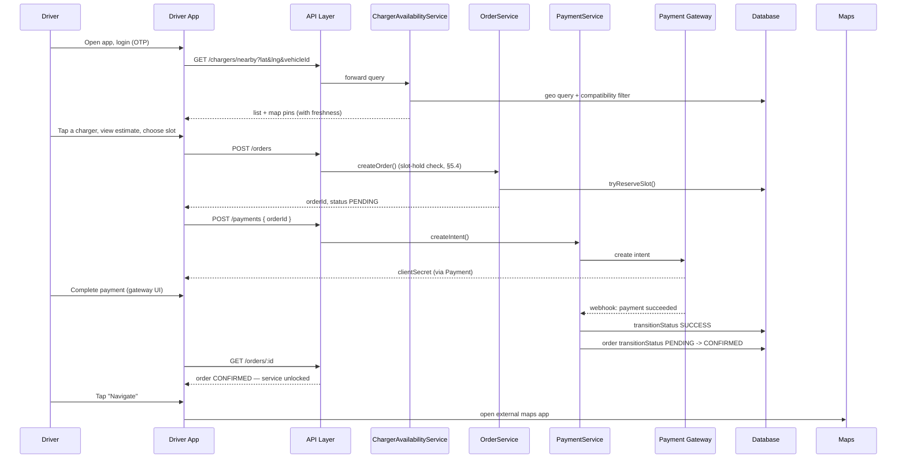

### 6.2 Flow 2 — Charge at the station

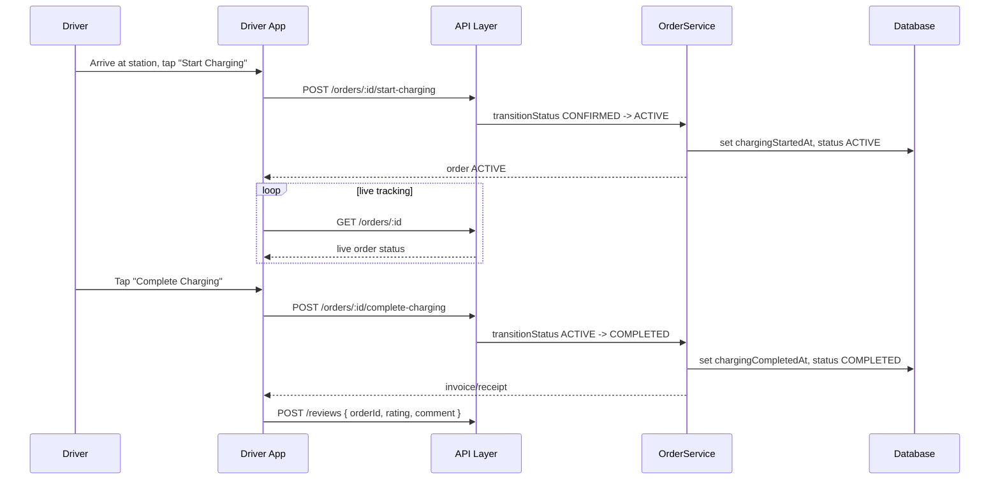

### 6.3 Flow 3 — Refund

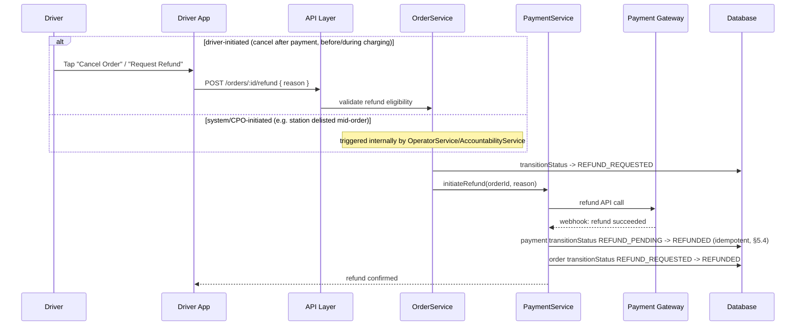

### 6.4 Flow 4 — Report a problem

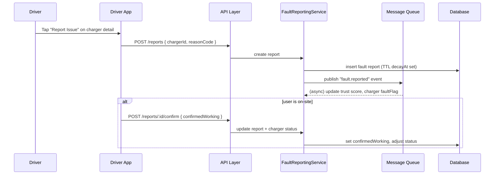

### 6.5 Flow 5 — Daily CPO acknowledgement

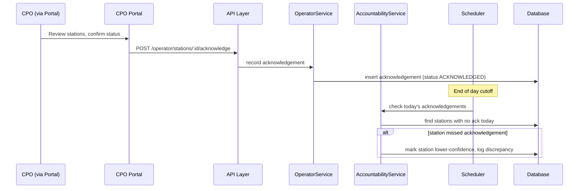

### 6.6 Flow 6 — Save a favorite

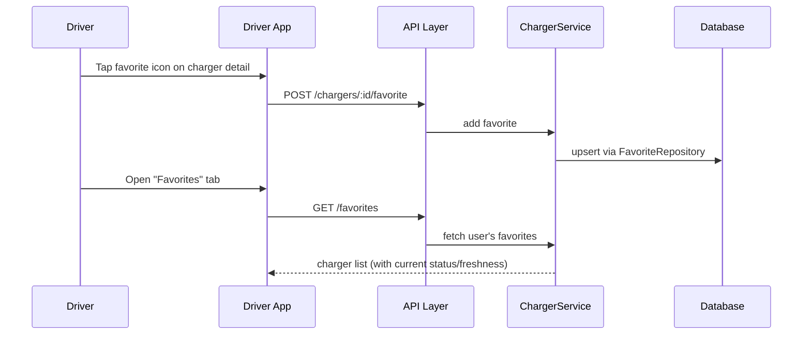

---

## 7. Scalability

| Concern                    | MVP approach                                                                       | First scale trigger                             | Evolution path                                                                |
| -------------------------- | ---------------------------------------------------------------------------------- | ----------------------------------------------- | ----------------------------------------------------------------------------- |
| Order concurrency          | Redis lock + unique index (§5.4)                                                   | Popular stations/slots seeing contention        | Dedicated order-conflict resolution service                                   |
| Payment/refund processing  | Synchronous intent creation, async webhook confirmation for both charge and refund | Volume beyond a single gateway's comfort        | Multi-gateway routing/failover                                                |
| Live order status delivery | Long polling                                                                       | Multi-city rollout, need for sub-second updates | WebSocket/SSE push                                                            |
| Geo queries                | Single Mongo Atlas cluster, `2dsphere` index                                       | Query latency degrades with growth              | Read replicas; cached hot-tile results by geohash                             |
| Nearby-search caching      | Redis cache, short TTL                                                             | Cache miss rate rising with more cities         | Precompute per-city hot zones                                                 |
| Backend compute            | EC2 Auto Scaling Group                                                             | Sustained CPU/mem pressure or multi-city launch | Split `ChargerAvailabilityService` and `OrderService` out first (highest QPS) |
| Accountability checks      | Single daily scheduled job                                                         | Station count grows past pilot scale            | Shard the daily check by city/operator                                        |
| Mobile OTA rollout         | EAS Update to all users at once                                                    | Bad update needs targeted rollback              | Staged rollout percentages via EAS channels                                   |
| Multi-city                 | Not designed for yet                                                               | Explicit multi-city launch decision             | City as a first-class dimension in routing/config                             |

---

## 8. Security

- **Auth (driver):** OTP-based, rate-limited, exponential backoff; short-lived JWT + refresh rotation.
- **Auth (CPO Portal):** separate credentials, MFA recommended.
- **Authorization:** Role-based — `driver`, `operator`, `admin`. CPO writes scoped to their own `stationId`s.
- **Rate limiting (API Gateway):** token bucket, tiered:
  - Strict: `/auth/otp/*`
  - Moderate: `/orders`, `/payments`, `/orders/:id/refund`, `/reports`, `/reviews`
  - Lenient: `/chargers/nearby`, `/chargers/:id`
  - All limited responses return `429` with `Retry-After`.
- **Concurrency safety:** see §5.4.
- **Payments and refunds:** ChargeHub never handles raw card data. All webhook payloads (payment _and_ refund) are signature-verified before processing; state transitions are idempotent. **Refund eligibility is validated server-side** (order status, refund window) — never trust a client-supplied "eligible" flag.
- **Data in transit/at rest:** TLS everywhere; MongoDB Atlas encryption at rest.
- **PII handling:** phone numbers masked in logs; cardholder data never touches ChargeHub's storage.
- **Local mobile storage:** AsyncStorage for non-sensitive data only; tokens in `expo-secure-store`.
- **Abuse prevention:** rate limits on fault-report, review, favorite, and refund-request actions per user/device.
- **Secrets management:** managed secrets store for DB creds, SMS keys, Maps key, payment gateway keys/webhook secrets (both charge and refund webhook secrets).

---

## 9. Observability

- **Logging, tracing, error tracking, performance, telemetry:** Sentry across both apps + backend.
- **Product/behavioral analytics:** Microsoft Clarity + Google Analytics 4.
- **Metrics:** activation, order conversion rate, payment completion rate, **refund rate** (and refund reason breakdown), favorite rate, review submission rate, freshness %, daily acknowledgement compliance rate; p50/p95 latency (order/payment/refund endpoints especially), payment/refund webhook processing lag, queue depth, order-conflict rejection rate.
- **Alerting:** payment/refund webhook failures, order double-conflict spikes, missed-acknowledgement rate, OTP failure rate, elevated 5xx, refund rate spiking above baseline (early signal of a station/pricing problem).

---

## 10. Testing

| Layer               | Approach                                                                                                                                                |
| ------------------- | ------------------------------------------------------------------------------------------------------------------------------------------------------- |
| Unit                | Jest across Express services (order slot logic, payment/refund state machine, strategy implementations, repository methods) and React Native components |
| Integration         | Supertest with a test Mongo instance; verify API contracts in §5.7, including payment and refund webhook handling with mocked gateway payloads          |
| Concurrency testing | Parallel order requests for the same slot; parallel refund-webhook replay                                                                               |
| Contract testing    | Payment gateway webhook schema (charge and refund)                                                                                                      |
| E2E                 | Detox covering §6 flows: place-and-pay-for-order, charge-at-station, refund, report-a-problem, daily-CPO-acknowledgement                                |
| Load/perf           | k6/Artillery against `/chargers/nearby` and `/orders`                                                                                                   |
| Manual/UAT          | Pilot-city test pass with real vehicles, real payments and refunds (sandboxed gateway), real CPOs acknowledging daily                                   |

---

## 11. Deployment (Rollout)

- **Environments:** dev → staging → production; payment gateway in sandbox/test mode (including refund API) until production.
- **CI/CD:** Driver App/CPO Portal via EAS Build + EAS Update; Express backend via GitHub Actions (`deploy.yml`) to EC2.
- **Rollout sequencing:** unchanged sequencing from the prior revision (§21 PRD delivery plan), with refund flow explicitly included in the Weeks 3–5 build scope and Weeks 6–7 pilot testing.
- **App store submission lead time** still needs to be built into the Week 8 timeline (§14).
- **Rolling deploys** on EC2; staged rollout percentages for mobile releases.

---

## 12. Rollback

- **Backend (EC2):** rolling deploy with automatic rollback on failed health checks.
- **Database:** MongoDB Atlas continuous backups, point-in-time restore; additive-first schema changes.
- **Mobile (JS-only):** instant rollback via EAS Update.
- **Mobile (native binary):** staged rollout percentage limits blast radius; no instant revert.
- **Payments and refunds:** never roll back a payment/refund-state migration without reconciling against the gateway's own record first.
- **Orders:** a bad deploy should fail closed (block new orders) rather than risk double-booking or a stuck refund state.
- **Rollback trigger criteria:** error rate, payment failure rate, refund failure rate, order-conflict rate, freshness %, missed-acknowledgement rate.

---

## 13. Future Scope

- **External CPO API Sync** — excluded from MVP per PRD V3.
- **Object Storage** — deferred.
- **Own payment ledger/wallet** — only if gateway-only proves insufficient.
- **Multi-city support** — out of scope per PRD.
- **Real-time push** — replacing long polling with WebSockets/SSE.
- **Commercial penalty automation** — MVP tracks the data; enforcement is operational for now.
- **Partial refunds / variable pricing based on actual energy delivered** — MVP assumes the paid estimate is the final price; metering-based adjustment (over/under the estimate) is a real follow-on question once real usage data exists.

---

## 14. Open items requiring your decision

1. Payment gateway vendor selection — must support both charge **and** refund APIs.
2. Refund policy specifics: cancellation window, whether a refund is full or partial if charging has already started, who approves system-initiated refunds.
3. SMS/OTP vendor selection.
4. CPO Portal MFA requirement.
5. Multi-city readiness (§13).
6. UX/wireframes need a full pass — mobile, pay-first, and now with a refund flow.
7. App store review timelines in the delivery plan.
8. Push notification provider — order confirmation, refund status, daily acknowledgement reminders.
9. Refreshed architecture diagram to replace the stale linked version.
